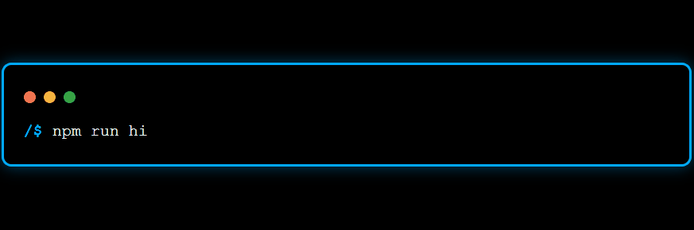

<h3 align="left">Languages and Tools:</h3>

<h4>🌐 Web Frontend:</h4>

  <a href="https://www.w3.org/html/" target="_blank" rel="noreferrer">
    
  </a>&nbsp;&nbsp;&nbsp;
  <a href="https://www.w3schools.com/css/" target="_blank" rel="noreferrer">
    
  </a>&nbsp;&nbsp;&nbsp;
  <a href="https://getbootstrap.com" target="_blank" rel="noreferrer">
    
  </a>&nbsp;&nbsp;&nbsp;
  <a href="https://tailwindcss.com/" target="_blank" rel="noreferrer">
    
  </a>&nbsp;&nbsp;&nbsp;
  <a href="https://developer.mozilla.org/en-US/docs/Web/JavaScript" target="_blank" rel="noreferrer">
    
  </a>&nbsp;&nbsp;&nbsp;
  <a href="https://reactjs.org/" target="_blank" rel="noreferrer">
    
  </a>&nbsp;&nbsp;&nbsp;
  <a href="https://redux.js.org" target="_blank" rel="noreferrer">
    
  </a>&nbsp;&nbsp;&nbsp;
  <a href="https://nextjs.org/" target="_blank" rel="noreferrer">
    
  </a>

<h4>💻 Programming Languages:</h4>

  <a href="https://www.cprogramming.com/" target="_blank" rel="noreferrer">
    
  </a>&nbsp;&nbsp;&nbsp;
  <a href="https://www.w3schools.com/cpp/" target="_blank" rel="noreferrer">
    
  </a>&nbsp;&nbsp;&nbsp;
  <a href="https://www.java.com" target="_blank" rel="noreferrer">
    
  </a>&nbsp;&nbsp;&nbsp;
  <a href="https://www.python.org" target="_blank" rel="noreferrer">
    
  </a>

<h4>⚙️ Backend & Runtime:</h4>

  <a href="https://nodejs.org" target="_blank" rel="noreferrer">
    
  </a>&nbsp;&nbsp;&nbsp;
  <a href="https://www.php.net" target="_blank" rel="noreferrer">
    
  </a>

<h4>🗄️ Databases:</h4>

  <a href="https://www.mongodb.com/" target="_blank" rel="noreferrer">
    
  </a>&nbsp;&nbsp;&nbsp;
  <a href="https://www.mysql.com/" target="_blank" rel="noreferrer">
    
  </a>&nbsp;&nbsp;&nbsp;
  <a href="https://www.postgresql.org" target="_blank" rel="noreferrer">
    
  </a>&nbsp;&nbsp;&nbsp;
  <a href="https://firebase.google.com/" target="_blank" rel="noreferrer">
    
  </a>

 

<h3 align="left">Connect with me:</h3>

  &nbsp;&nbsp;&nbsp;
  

